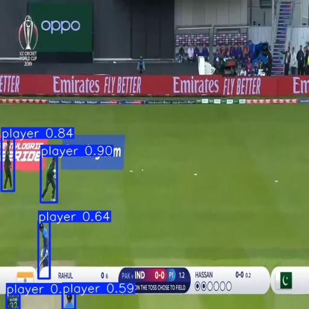
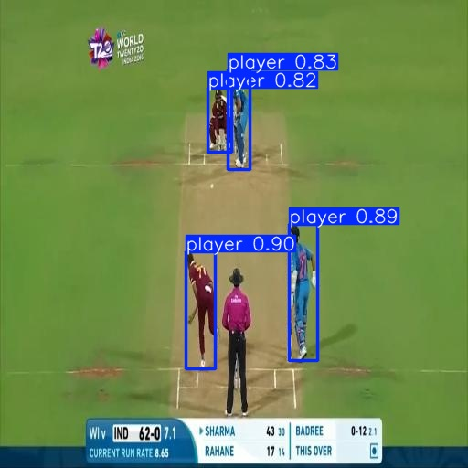
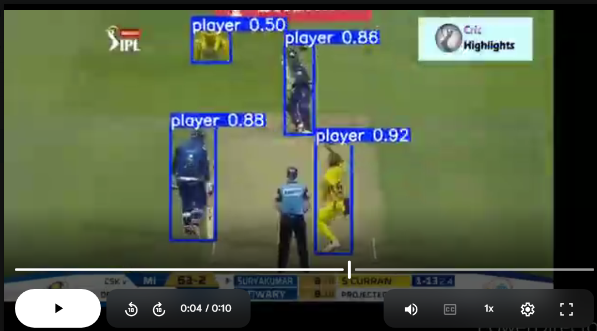
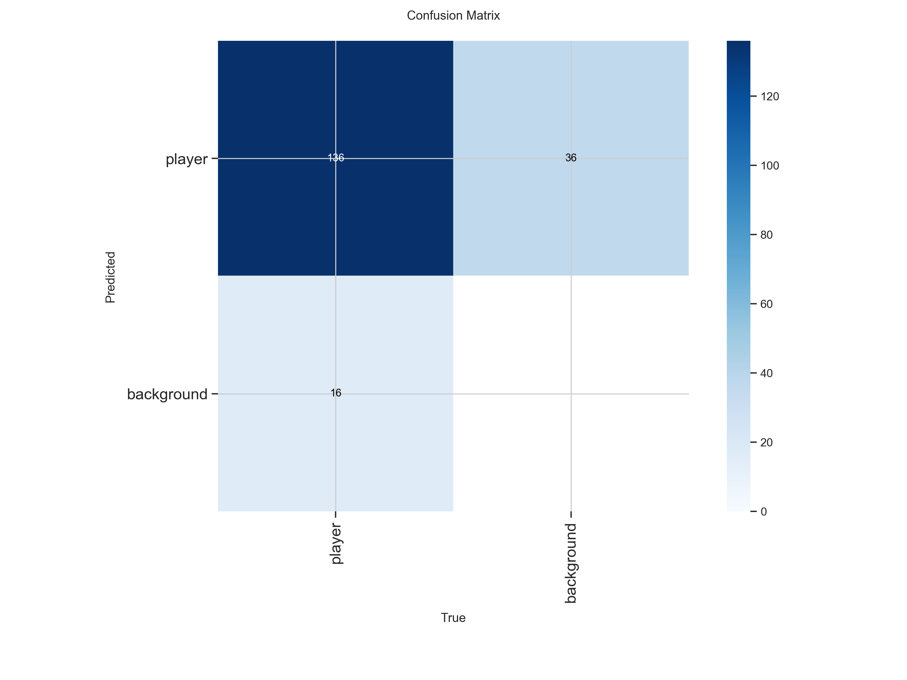
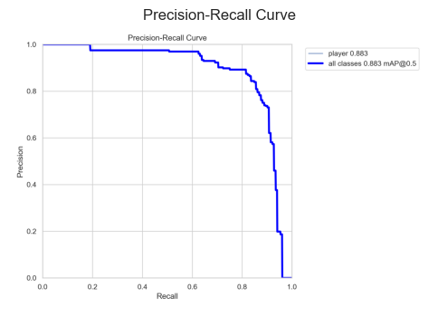
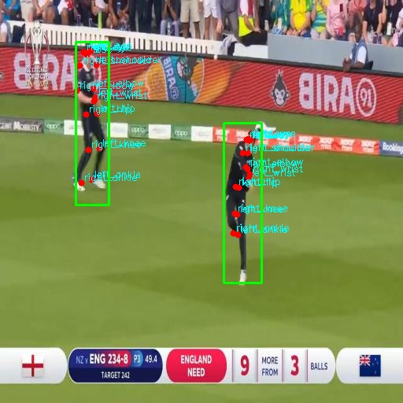

# Sports-Player-and-Keypoint-Detection-
Cricket player detecting using YOLOv8 and player keypoint detection using OpenPose 

# 🏏 Cricket Player Detection and Keypoint Estimation using YOLOv8

**DS5216 – Artificial Intelligence**  
Programming Assignment II - 

This project develops a deep learning pipeline for **automatic cricket player detection** and **player pose estimation** from cricket videos. The system combines a custom-trained YOLOv8 object detector with a YOLOv8-Pose model to identify players and estimate their body keypoints, enabling further sports analytics applications.

---

# Project Overview

The project consists of two major tasks.

### Task 1 – Cricket Player Detection
- Custom YOLOv8 model trained on manually annotated cricket frames.
- Detects multiple players in both images and videos.
- Evaluated using Precision, Recall and mAP metrics.

### Task 2 – Player Keypoint Detection
- Uses YOLOv8-Pose (OpenPose-like approach).
- Estimates 17 human body joints for each detected player.
- Produces skeletal representations for posture analysis.

---

# Dataset

- 10 cricket videos collected from Kaggle
- Videos manually cropped into short clips
- Approximately **300 annotated frames**
- Manual annotation performed using Roboflow
- Dataset split:
  - Training: 70%
  - Validation: 20%
  - Testing: 10%

---

# Technologies Used

- Python
- Google Colab
- PyTorch
- Ultralytics YOLOv8
- YOLOv8-Pose
- OpenCV
- NumPy
- Pandas
- Matplotlib

---

# Repository Structure

```text
notebooks/
    1.Data preprocessing
    2.Model training and evaluation using YOLOv8
    Player_Keypoint_detection

dataset with train valid test split/
    train/
    valid/
    test/

Report - DTS2433_ DS5216 AI Programming Assignment II.pdf
requirements and important details.txt
dataset_link.txt

1A. player detection results on test images
1B. payer detection on a video stream
1C. player detection performance metrics curves and best model weights
2. keypoint detection results

```

---

# Methodology

```text
Input Cricket Image/Video
          │
          ▼
YOLOv8 Player Detection
          │
          ▼
Player Cropping
          │
          ▼
YOLOv8-Pose Keypoint Detection
          │
          ▼
Skeleton Visualization
```

---

# Model Performance

## Player Detection

| Metric | Validation | Test |
|---------|-----------:|-----:|
| Precision | 0.8427 | 0.8583 |
| Recall | 0.8487 | 0.7684 |
| mAP@0.5 | 0.8832 | 0.8854 |
| mAP@0.5:0.95 | 0.5911 | 0.4954 |

## Keypoint Detection

| Metric | Value |
|---------|------:|
| Average Keypoints / Person | **17.0** |
| Average Keypoint Confidence | **0.6949** |

---

# Results

## Player Detection Examples



---

## Video Detection



---
## Training Performance




---

## Keypoint Detection



---

# Key Features

- Custom-trained cricket player detector
- Multi-player detection
- OpenPose-style human keypoint estimation
- Works on both images and videos
- Real-time compatible architecture
- Modular Google Colab implementation

---

# Limitations

- Pose model pretrained on COCO rather than cricket-specific poses.
- Reduced performance for small or occluded players.
- Bounding box localization decreases under strict IoU thresholds.
- No temporal player tracking across video frames.

---

# Future Improvements

- Train with a larger and more diverse cricket dataset.
- Fine-tune YOLOv8-Pose using manually annotated cricket keypoints.
- Introduce multiple player classes (batsman, bowler, fielder, wicketkeeper, umpire).
- Integrate DeepSORT/ByteTrack for player tracking.
- Estimate cricket-specific features such as bat position and bowling arm angle.

---

# Running the Project

Clone the repository.

```bash
git clone https://github.com/yourusername/your-repository.git
```

Install dependencies.

```bash
pip install -r requirements.txt
```

Run the notebooks in order.

1. Data Preprocessing
2. Player Detection
3. Keypoint Detection

---

# Repository Contents

| Folder | Description |
|---------|-------------|
| notebooks | Google Colab notebooks |
| dataset | Dataset information |
|report|
|dataset link file|
|instructions file|

---

# Author

**DTS2433: R. D. Y. Vimukthi**


